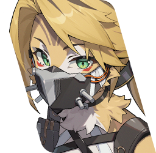

# Trigger Quick Guide

## Introduction

This is a quick guide on how to build and play Trigger and what characters she synergizes with. If you want a more in-depth guide, you can check our [Trigger Full Guide](full.md).

You can also check the [Frequently Asked Questions](#frequently-asked-questions) section, which may answer most of your questions!

## TL;DR

Trigger is an Electric - Stun agent of the OBOL Squad faction. Her role in a team is that of an off-field stunner with good supporting abilities with a damage buff for out-of-stun *and* stunned enemies, and even more with her signature W-Engine that reduces the enemy DEF by 25% at O1.

*[O1]: Overclock 1 = 1 weapon copy

This makes her a perfect team-mate for DPSes that require a long time on the field.

She has a unique passive in her Additional Ability that converts her Crit Rate between 40% and 90% into up to 75% daze efficiency on her off-field attacks.

If you need it, here is a quick overview of how to build her:

## How to play Trigger?

Trigger has a meter called **Purge** that you can see under her icon at any time.

<figure markdown="span">
    
    <figcaption>Trigger's Purge meter</figcaption>
</figure>

To gain **Purge**, you can hold the attack button to enter **Sniper Stance**. You need 4 sniper shots to fully charge the meter, but in most rotations, you don't have to fully charge the meter, and 2 shots are usually enough. Releasing the attack button will trigger (lol) a Quick Assist.

!!! note "About Trigger's Quick Assist"
    Trigger's Quick Assist cycles backwards through the team, like Pulchra's and Seth's, so it will switch to the *previous* character in the team order!

<figure markdown="span">
    
    <figcaption>Sniper Stance</figcaption>
</figure>

When she has **Purge**, and an ally deals damage, she will do an **Aftershock** attack on the enemies (once every 3 seconds at M0), increasing their daze and consuming **Purge**. She will do additional **Aftershock** attacks when the ally uses an EX skill, Assist follow-up or Ultimate.

<figure markdown="span">
    
    <figcaption>Trigger's Aftershocks</figcaption>
</figure>

When Trigger is on the field and uses her EX skill or Ultimate, she will enter the **Coordinated Support** state, where her **Aftershocks** are improved and don't consume **Purge**, for up to 10 off-field attacks and 20s. This also triggers a Quick Assist.

<figure markdown="span">
    
    <figcaption>Purge meter in Coordinated Support</figcaption>
</figure>

Her Defensive Assist and Assist Follow-up also deal a decent amount of daze, so it's worth using them!

Here's a summary of Trigger's gameplay:

1. Hold basic attack to gain **Purge**
2. Use EX or Ultimate when you can
3. Switch to your DPS and let her cook

## Team compositions

Trigger's Additional Ability requires her to be paired with an Attacker or Electric character.
This gives her a good flexibility when it comes to team compositions.

### Example teams

Here are some team examples featuring Trigger:

#### On-field Attacker

This is Trigger's strongest team at her release. Silver Soldier Anby synergizes very well with Trigger, but this team also works with other on-field DPSes like Ellen or Evelyn as.
Astra Yao can be replaced with any other support, Caesar, or Pulchra if you don't have a better option.

#### On-field Anomaly

Teams with an on-field Anomaly DPS can work. Yanagi enables Trigger's Additional Ability, but other Anomaly DPSes can work as long as you have an Electric agent in the team.
The 3rd agent can be either a Defense agent (like Seth or Caesar), a support (like Rina) or another Anomaly character.

#### Dual-Stun

This works best for burst DPSes that require little field time but need a frequent stun-window to deal damage, like Harumasa or Zhu Yuan.
The other stun agent can take the remaining part of the field time.

### Notable synergies

| Agent        | Notes                                     |
| ------------------------------------------------ | ----- |
|  | As you could guess from the team compositions, the new Silver Soldier Anby synergizes well with Trigger. Her Core Skill buffs the Aftershock damage from the whole team, which benefits herself but also Trigger. She enjoys having a lot of field time too, which suits Trigger's off-field style well. |
|  | Qingyi is the opposite of Trigger: an *on-field* Electric Stun character. So when they're paired together, Qingyi can take the field time and together they can stun the enemy very quickly. This works especially well in double-stun teams with a burst DPS that enjoys frequent stun windows like Harumasa. Qingyi being Electric, she also enables Trigger's Additional Ability. |
|  | Like Qingyi, Rina is an Electric agent, so she also enables Trigger's Additional Ability. Trigger being an off-field stunner, she frees a lot of field time for Rina to come refresh her rather short buff. |
| { style="width: 67%" } | Pulchra can synergize with Trigger, allowing for faster stuns and more DPS field time. The gameplay is a bit strange due to the double backwards Quick Assist, bust still playable. Just make sure you used up all of Pulchra's stacks before switching back to her. |

### Possible anti-synergies

These are not always anti-synergies, just some attention points when building teams with Trigger.

| Agents       | Notes                                     |
| ------------------------------------------------ | ----- |
|   | Burst DPSes like Harumasa or Zhu Yuan have big downtimes in their elemental damage, which is why they're usually paired with an *on-field* Stun character. Therefore, in a team with Trigger, both are going to fight to *not* have the field time. However, this can work better if the 3rd character on the team is an on-field Stun character like Qingyi. But beware that you could be missing out on some bigger buffs from using a support instead of Trigger. |
|   | At first glance, Evelyn and Soldier 11 look like they would have a rather good synergy with Trigger, since they are both field-heavy DPSes. However, bosses that are weak to Fire are often resistant to Electric, which would highly impact Trigger's daze efficiency. So when the bosses are resistant to Electric damage, a Fire Stun character like Lighter or Koleda would still be significantly better. |

## Skill priority

Here is Trigger's skill leveling-up priority, as recommended by the game:

## Mindscapes overview

=== " Sharpened Senses"
    
    { .mindscape align=left }

    The Stun DMG Multiplier applied through **Core Passive: Soul-Searching Gaze** is increased by an additional 20%. When activating **Basic Attack: Harmonizing Shot**, the cooldown is reduced to 2s. **Purge** gained upon hitting an enemy with the continuous fire or charged counter in **Sniper Stance** increases by 25%. Maximum **Purge** increases to 125.

    * Great Mindscape
    * Improves Trigger's team damage buff
    * Reduces off-field attacks cooldown
    * Increases the maximum amount of off-field attacks stacks

=== " Ether Vision"

    { .mindscape align=left }

    Upon using an **Aftershock**, Trigger gains 1 stack of **Hunter's Gaze**. When executing a Finishing Move in **Sniper Stance**, Trigger gains 2 stacks of **Hunter's Gaze**. Each stack of **Hunter's Gaze** increases all squad members' CRIT DMG by 6%, stacking up to 4 times, and lasting 10s. Repeated triggers reset the duration.

    * Great Mindscape as well
    * Gives Trigger a team-wide crit. damage buff, up to 24%

=== " Homecoming"

    { .mindscape align=left }

    **Basic Attack**, **Dodge**, **Assist**, **Special Attack**, and **Chain Attack** Lv. +2.

    * Generally good Mindscape
    * Levels up Basic Attack so slightly improves off-field attacks' daze dealt
    * Pretty art

=== " Concealment"

    { .mindscape align=left }

    When Trigger enters or extends **Coordinated Support**, while the state is active, the next time other squad members trigger **Basic Attack: Harmonizing Shot** or **Basic Attack: Harmonizing Shot - Tartarus**, it will trigger **Disconnect** upon hitting an enemy, dealing additional DMG equal to 200% of Trigger's ATK and inflict Daze equal to 120% of Trigger's Impact. This skill has a relatively high Interrupt Level.

    * Rather good Mindscape, great stopping point
    * Increase in her off-field attacks' damage and daze dealt

=== " Locked In"

    { .mindscape align=left }

    **Basic Attack**, **Dodge**, **Assist**, **Special Attack**, and **Chain Attack** Lv. +2.

    * Generally good Mindscape
    * Same as M3

=== " Beyond the River of the Dead"

    { .mindscape align=left }

    Upon entering the battlefield, Trigger gains 5 **Armor Break Rounds**. For every 25 **Purge** consumed, Trigger gains 1 additional **Armor Break Round**, up to a maximum of 5 rounds. While possessing **Armor Break Rounds**, when Trigger hits a target in **Sniper Stance**, 1 **Armor Break Round** is consumed to deal additional **Electric DMG** equal to 1,200% of Trigger's ATK. In addition, this instance of DMG is additionally increased by 50%. This effect can trigger once every 0.2s.

    * Huge increase of her on-field damage in Sniper Stance
    * Do 5 sniper shots for maximum damage
    * Prettier art

## W-Engines

Her signature weapon **Spectral Glaze** is obviously the best for her, and by a significant amount. With a **unique Crit Rate main stat**, and an effect that **reduces the enemy DEF** by 25% while also **increasing her Impact**, it's hard to find an alternative W-Engine that can compete. But she is still more than playable with alternatives, so here is a list:

*[DEF]: Defense

| W-Engine       | Notes                                     |
| ------------------------------------------------ | ----- |
|  | Her signature weapon. Obviously the best choice, with a great supporting ability and the highest increase in her daze potential among the Stun W-Engines. |
|  | The best gacha alternative! Trigger can max out the buffs fairly quickly. But let's be honest, if you have Ice-Jade Teapot, you probably have Qingyi and you'll probably want her to use her signature weapon. |
|  | Lycaon's signature W-Engine. The best "free" alternative. Trigger's off-field attack can consistently refresh the daze buff of this weapon. |
|  | The best A-rank alternative, especially for **Deadly Assault**. Doesn't need any special gameplay to trigger its effects, but you're going to see a great downtime if you can't kill the enemy quickly after the first stun window (like against Shiyu Defense bosses). |
|  | Despite buffing Physical Damage, this weapon can also grant 31% Impact to Trigger pretty consistently, which makes it a better option in **Shiyu Defense** or other game modes with highly resistant enemies. |
| { style="width: 67%" } | Lighter's signature engine. A great option for an Ice or Fire DPS. She can get max stacks just like the other S-rank W-Engines, thanks to her off-field attacks being considered Basic Attacks. |
| Other Stun W-Engines | Not much to say about these... The other W-Engines mentionned above are better. These have a slow build-up at the start, but become good midway. |
| Crit Rate W-Engines | Worse than Stun W-Engines in general. |

### Pull priority?

> Should I pull for her signature W-Engine or her Mindscapes first?

Her M1 and M2 are great! But not as great as everything her signature weapon gives her, so the W-Engine is still the highest priority!

> Should I pull Anby's or Trigger's W-Engine?

Depends on what your goal is.

If you're pulling Trigger only to strengthen your S Anby team to the maximum, then Anby's weapon is definitely a higher upgrade.

If you want your Trigger to be useful in as many teams as possible, then Trigger's weapon will be more important.

## Drive discs

Since Trigger is a Stun agent, you will want to maximize her Daze dealt. And for that, you can either choose discs that directly increase her Impact or Daze dealt, or take advantage of her passive that converts her Crit Rate up to 90% into up to 75% Daze dealt.

### 4-set

| Disc set       | Notes                                     |
| ------------------------------------------------ | ----- |
|  | The disc 4-set that gives her the most daze potential, with 6% impact and 20% daze efficiency. Can be paired with Woodpecker Electro if more Crit Rate is required to cap her conversion. |
|  | A good 4-set that gives up to 12% Crit Rate, resulting in 18% more daze dealt for Trigger. Less than Shockstar Disco, but this set also increases her own damage. It is **the best 4-set for M4+ Trigger**, but still usable at M0 if you have good stats on it. The downside is that you may be over-capping her conversion with W-Engine and discs stats. |
|  | The only 4-set for her that can buff the team's damage consistently, at the cost of her daze dealt. A bit annoying to refresh as you have to do Defensive Assists pretty often. Can be used for a more "support build" for Trigger, but definitely not her main build. |

### 2-set

| Disc set       | Notes                                     |
| ------------------------------------------------ | ----- |
|  | Easy way to get closer to 90% Crit Rate for her conversion. Works with all the 4-set options mentioned earlier. |
|  | Only works with the Shadow Harmony (or the Proto Punk) build. Good if you already cap her Crit Rate conversion, otherwise Woodpecker Electro is still better. |
|  | Could be a good idea if you already reached the 90% Crit Rate cap. Allows Trigger to enter the Coordinated Support state more often to stun the enemy faster. |
|  | Offensive options for if you already reached the 90% Crit Rate cap, to maximize Trigger's potential by increasing her damage. |

### Disc stats

Once again, because of her Crit Rate to Daze conversion up to 90% Crit Rate, you will want to reach that cap with disc stats. Since she is a Stun character, Impact disc 6 is obvious. The other substats are offensive substats to get as much extra damage as possible out of her.

## Frequently Asked Questions

**Who is Trigger?**

> Trigger is a sniper in the Obol Squad of the New Eridu Defense Force, alongside currently playable character Soldier 11 for instance.
> During an event in the old Eridu, her eyes got infected with ether, giving her supernatural vision, at the cost of having to wear a mask to prevent her eyes from "volatilizing".

**What do we know about Trigger?**

> **Faction:** Obol Squad
> 
> **Appearance:** Trigger is a tall, blonde woman wearing a mask covering the upper part of her face. She's dressed in black and light orange like other Obol Squad member Soldier 11.
> 
> **Weapon:** She wields a black and light orange sniper.

**Is she voiced?**

> Yes! 
> **EN:** *Not announced* 
> **CN:** Qin Ziyi (秦紫翼) 
> **JP:** Nanjō Yoshino (南條 愛乃) 
> **KR:** Lim Eun-ji (임은지) 

**Will Trigger be playable?**

> Trigger has been drip marketed as a playable **S rank, Electric Stun character**. She will release in ZZZ **version 1.6** along Silver Soldier Anby.

**What role does she play in a team?**

> She is a stun character so her main focus will be stunning the enemies. She has off-field attacks, making her rather different from the usual Stun characters that take a lot of field time.
> 
> Playing Trigger as a main DPS seems complicated right now, every beta change made her even closer to a Stun character and further away from an on-field DPS (but an off-field main DPS might work in a double-carry team).

**Does Trigger work with [character]?**

> This question is asked pretty often, mainly **"Does/will Trigger work with Soldier 11?"**
> 
> Right now, the new character **Silver Soldier Anby should be her best partner**, because of their great synergy with their new gameplay element called "Aftershocks".
> 
> However, Trigger **is still a good general Stun character** with any other DPS.
> For Soldier 11 and Evelyn specifically though, most fire-weak bosses are resistant to electric, so it might not be the best combo ever.

**What drive discs does she need?**

> The best 4-set right now is Shockstar Disco, as it's the set that gives her the most daze potential. The new 1.6 set Shadow Harmony is also playable, favoring her personal damage at the cost of some daze. However, it becomes her best 4-set starting at M4.
> 
> As for the 2-set, it will likely be Woodpecker Electro (crit rate) if you need more crit rate to cap her conversion (the cap is at 90% crit rate). If you don't need more crit rate, you can use any offensive 2-set, or Swing Jazz if you feel like you want her Coordinated Support state more often.
> 
> For info on the disc stats, check out the [disc stats section](#disc-stats) of this guide!

**Does she need her W-Engine?**

> Trigger has a crit rate to impact conversion, up to 90% crit rate. So obviously her weapon gives crit rate to help reach that high cap, which is a unique stat among stun W-Engines.
> 
> You can always use a regular impact W-Engine, to get the impact without the crit rate. The performance with any other Stun engine (S-ranks like Lycaon's, Koleda's etc., A-ranks Anby's, Pulchra's, fossile etc.) is similar and noticeably below her signature engine. Attacker engines with Crit Rate aren't worth it.
> 
> It's also important to note that her W-Engine has a 25% DEF reduction effect. In addition to that, it also gives her even more impact, making alternative stun engines look weaker.

**Does she really need 90% Crit Rate?**

> Yup, or as close as you can get to 90%! Losing even 10% Crit Rate means losing 15% daze efficiency, you wouldn't want that to happen!

**How does she compare to Lighter/Qingyi/...?**

> Most of her daze is dealt off-field, while another on-field agent is also dealing daze to the enemy, so it's really hard to compare. But her time-to-stun seems balanced with the other limited Stun agents, so who you use is more a matter of team composition.

## Closing statement

In conclusion, Trigger is a new Stun character with a very off-field playstyle, similar to Pulchra who released earlier the same version, but with even less field time required.

She can be played with most DPSes with some clever team building tricks, and will be the BiS stunner for Aftershock DPSes like the new Silver Soldier Anby.

Thanks to everyone who helped work on this guide, and thank *you* for reading!

We will keep the guide updated as future content gives Trigger new gameplays or team opportunities!